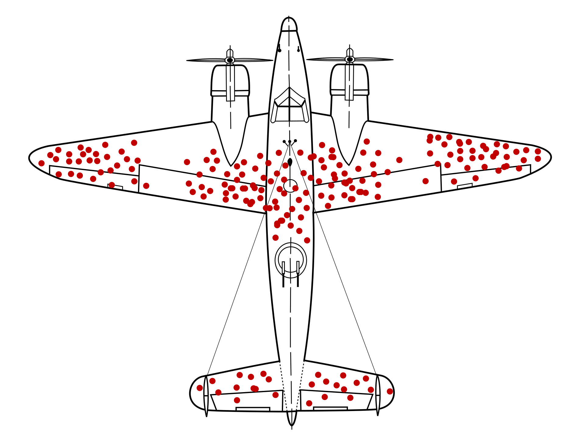

```{r setup, include=FALSE}
options(htmltools.dir.version = FALSE)
r <- getOption("repos")
r["CRAN"] <- "http://cran.cnr.berkeley.edu/"
options(repos = r)
```

<style>

.remark-slide-number {
  position: inherit;
}

.remark-slide-number .progress-bar-container {
  position: absolute;
  bottom: 0;
  height: 6px;
  display: block;
  left: 0;
  right: 0;
}

.remark-slide-number .progress-bar {
  height: 100%;
  background-color: #f2a900;
}

.orange {
  color: #f2a900;
}
</style>
# Today's Agenda

.font150[

What is POLI 30 D?

Syllabus and bureaucracy

About me

About you

]

---

class: inverse, center, middle

# POLI 30 D

<html><div style='float:left'></div><hr color='#f2a900' size=1px width=720px></html> 

---

# POLI 30 D

.font130[
* Political Inquiry

* In this class, you are going to learn how Political Scientists produce rigorous empirical research.

* **Rigorous:** Reproducible and transparent.

* **Empirical:** Using data.

]

---

# POLI 30 D

.font130[
* This class aims to empower you to consume and produce knowledge. 

* You will be able to evaluate the strength of empirical claims, i.e., calling B.S.

* You will be able to produce elementary data analysis using the statistical software R.

* At a minimum, you will look at the newspaper differently.

]

---

# POLI 30 D

.font130[
* In WWII, the USAF needed to improve the reliability of their bombers.

* They collected data on planes that went to war and back to see where they should reinforce.

{width=50%}

]

---

# POLI 30 D

.font130[
* My mother-in-law, 65+ years old lady, was diagnosed with hep C.

* I did what any responsible in-law was supposed to do...

* The doctor was sure about her diagnostic: she told my wife that the test had an 80% accuracy (i.e., an 20% false-negative rate).

* But it turns out that the test she ran had a 50% false-positive rate.

* Now, spse of 1000 people that do the test, ten tests positive (1%). What are the chances that these people indeed have the disease?

|                       | test negative | test positive |
|-----------------------|:-------------:|:-------------:|
| does not have disease | .99*.5 = .495 | .99*.5 = .495 |
|           has disease | .01*.2 = .002 | .01*.8 = .008 |

]

---
# POLI 30 D

.font130[
* This class aims to empower you to consume and produce knowledge. 

* You will be able to evaluate the strength of empirical claims, i.e., calling B.S.

* You will be able to produce elementary data analysis using the statistical software R.

* At a minimum, you will look at the newspaper differently.

]

---

# POLI 30 D

.font130[
Grading:

|     Assignment     | Points | Weight |                                                          Due Date                                                         |
|:------------------:|:------:|:------:|:-------------------------------------------------------------------------------------------------------------------------:|
| Participation x 28 |   10   |  10 %  | Through i-clicker                                                                                                         |
| Quizzes x 28       |   10   |  20 %  | Before the next lecture start                                                                                             |
| Problem Sets x 4   |   10   |  50 %  | PS 1 – Jan 27<br>PS 2 – Feb 10<br>PS 3 – Feb 24<br>PS 4 – Mar 10<br>All PSs will be live two weeks before their due date. |
| Final Exam         |   10   |  20 %  | March 22, 8-11 am                                                                                                         |
|                    |        |  100%  |                                                                                                                           |

]

---

# Bureaucracy

.font150[
* Attendance is required. I will use the i-clicker to check it. More on that to come.

* Academic Integrity: feel free to work in groups, but turn in your own work.

* The main book we will use is 

**Llaudet and Imai. Data Analysis for Social Science: A Friendly and Practical Introduction. United States, Princeton University Press, 2022.**

]

---

# Lecture x TA sections and Communication

.font150[
* Lectures: more theoretical

* TA sections: more computational

* I hold office hours daily, from 11 AM to 12 PM.

* You need to sign in using [https://calendly.com/umbertomig/office-hours](https://calendly.com/umbertomig/office-hours)

]

---

# About me

.font150[
* My name is Umberto Mignozzetti.

* I hold a Ph.D. from New York University.

* I study how institution design affects welfare in developing democracies.

* In my free time, I like to watch soccer.

]

---

# About you

.font130[

* You are likely sitting close to a future Apple CEO, US Senator, NGO leader, or Eccentric Billionaire.

* Introduce yourself to the person next to you.

* Tell them your name and your majors / minors / study interests.

* Tell them what you like to do in your free time.

]

---

class: inverse, center, middle

# Questions?

<html><div style='float:left'></div><hr color='#f2a900' size=1px width=720px></html> 

---

class: inverse, center, middle

# See you in the next class!

<html><div style='float:left'></div><hr color='#f2a900' size=1px width=720px></html>